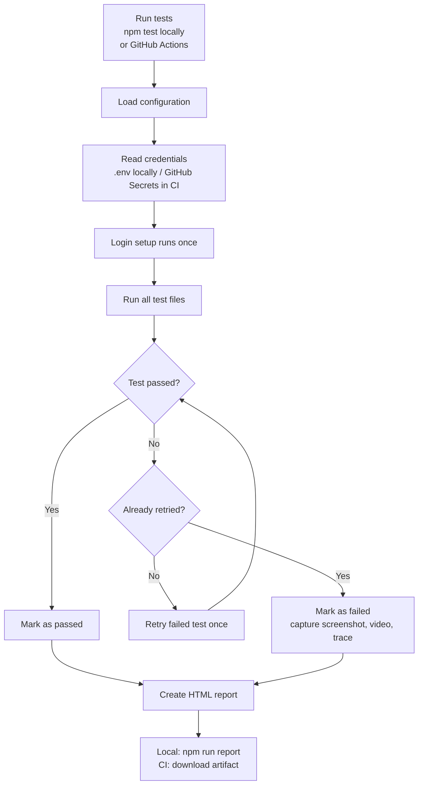

# Playwright Automation Framework

End-to-end UI test framework for the OrangeHRM demo application, built with Playwright and JavaScript. It uses page objects, reusable fixtures, authenticated storage state, coverage tracking, and GitHub Actions.

## What it includes

- Page Object Model under `src/pages/`
- Reusable page-object fixtures under `src/fixtures/`
- One-time admin login setup with Playwright storage state
- Native Playwright HTML reports, including screenshots, video, and traces for failures
- Requirement-to-test coverage tracking in Markdown
- GitHub Actions workflow for tests on pushes, pull requests, and manual runs
- Project-local `.claude` skills and rules for consistent test authoring

## Local setup

```powershell
npm install
npx playwright install chromium
Copy-Item .env.example .env
```

Add your local credentials to `.env`:

```env
BASE_URL=https://opensource-demo.orangehrmlive.com
TEST_ADMIN_USER=your-user
TEST_ADMIN_PASS=your-password
```

`.env` is ignored by Git. The Playwright configuration loads it automatically with `dotenv`.

## Run tests

```powershell
npm test                 # complete headless suite
npm run test:headed      # visible browser
npm run test:ui          # Playwright UI Mode
npm run test:auth-setup  # refresh only the admin storage state
npm run report           # open the latest local HTML report
npm run coverage         # regenerate all coverage rollups
npm run artillery:load   # run the Artillery Playwright load profile
npm run artillery:quick  # smaller smoke-style Artillery run
```

The `setup` project authenticates once and writes `auth/admin.json`. Authenticated specs reuse that state; login-flow tests explicitly use an empty state instead.

## Artillery quick vs full load

Artillery is kept as a separate performance layer from the Playwright functional suite. The project now uses separate YAML profiles so you can run a quick smoke check or a full load profile independently:

- `artillery/quick-smoke.yml` — lightweight smoke run for quick validation
- `artillery/load-suite.yml` — full multi-scenario load profile
- `artillery/quick-smoke.js` — smoke flow processor
- `artillery/load-suite.js` — full-suite scenario aggregator

Recommended usage:

```powershell
npm run artillery:quick
npm run artillery:load
```

The associated GitHub Actions workflows are split the same way:

- `.github/workflows/artillery-quick.yml` — runs the quick smoke profile
- `.github/workflows/artillery-full.yml` — runs the full load suite

This keeps the CI signal clear: the quick smoke job fails fast for regressions, while the full suite is used for deeper load validation.

## Test execution flow



A test that passes on its retry is marked as **flaky** in the Playwright report.

## Coverage workflow

1. Add test requirements to `test-requirements/<module>.md`.
2. Implement matching page objects and specs.
3. Set the implemented test case to `Automated` in `test-cases/<module>/<page>.md`.
4. Run `npm run coverage`.

The coverage script regenerates these two identical master rollups:

- `test-coverage.md`
- `test-requirements/test-coverage.md`

Do not edit calculated coverage totals manually.

## GitHub Actions and secrets

The workflow at `.github/workflows/playwright.yml` runs on pushes and pull requests to `main`, and can also be started manually from the GitHub **Actions** tab.

Add these repository secrets in **Settings → Secrets and variables → Actions**:

- `TEST_ADMIN_USER`
- `TEST_ADMIN_PASS`

Optionally add the repository variable `BASE_URL` for a different target environment. The workflow uploads the Playwright HTML report as an artifact after every non-cancelled run. Download and extract it, then open `index.html` to view the interactive report.

### AI test automation workflow

`.github/workflows/automate-test-case.yml` is a manual workflow template for automating one requirement at a time. After adding the `ANTHROPIC_API_KEY` repository secret, run **Automate Test Case** from the GitHub **Actions** tab and enter a test ID such as `TC-PIM-EMPLIST-004`.

The workflow also includes a boolean input named `create_load_tests`. If you set it to `true`, the same automation flow will create a matching Artillery load scenario for the same feature and verify the generated load wiring as part of the run. If it is left as `false`, only the Playwright functional automation is generated and verified.

The workflow validates the ID in `test-requirements/`, creates `feature/<test-case-id>` from `main`, instructs Claude Code to follow the project `create-new-tests` skill, runs the targeted test, and optionally validates the Artillery load wiring before committing the generated allowed files and opening a pull request to `main`. It needs `TEST_ADMIN_USER` and `TEST_ADMIN_PASS` secrets as well.

## Project layout

```text
.github/workflows/playwright.yml  GitHub Actions workflow
.claude/                          Test-authoring skills and framework rules
src/pages/                        Page objects
src/fixtures/                     Shared Playwright fixtures
tests-setup/                      Authentication setup project
tests/                            Playwright specifications
test-requirements/                Test requirements and a generated coverage copy
test-cases/                       Per-page coverage tracking
scripts/update-coverage.js        Coverage generator
```

## Artillery load testing

Artillery is added as a separate performance layer in the `artillery/` folder and does not alter the Playwright functional suite. The project intentionally keeps performance profiles separate from functional test specs so the browser-based load runner and the Playwright test runner do not share the same lifecycle or assumptions.

The current setup includes:

- `artillery/quick-smoke.yml` for a light smoke validation run
- `artillery/load-suite.yml` for the full multi-scenario load run
- dedicated GitHub Actions workflows for each profile

Artillery outputs its own metrics separately from the Playwright HTML report. Keep load-test profiles and result artifacts isolated from the functional-test workflow.
